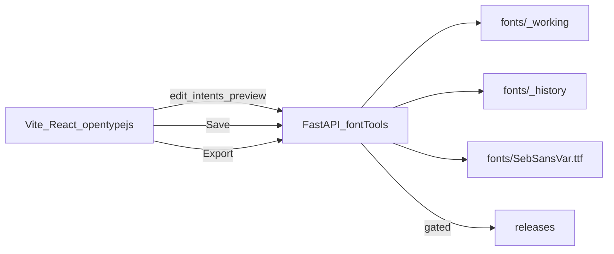

# System Architecture

```yaml
id: A01
title: System architecture
status: ready
depends_on: [GOV, V01, V04]
priority: P0
normative: true
```

## Stack

| Layer | Choice |
|-------|--------|
| Frontend | Vite + React + TypeScript |
| Font parse / canvas render | opentype.js |
| Binary mutations | Python FastAPI sidecar + fontTools |
| Dev orchestration | Root `npm run dev` via `concurrently` (Vite + uvicorn) |
| Storage | Local filesystem in this project folder (git-versioned); **no database** |
| Auth / deploy | None for the studio |

## Responsibility split



| Concern | Owner |
|---------|--------|
| Glyph outline display, hit-testing points, UI state, undo stack (UI-level) | Browser |
| gvar-aware interpolation, committing outline/metric edits to TTF, GSUB, instancing, ttfautohint, fontbakery, HarfBuzz smoke, zip | Python sidecar |
| Source of truth after Save | `fonts/SebSansVar.ttf` on disk |

**Rule:** The browser must never be the source of truth for font binary edits. It sends **edit intents**; Python mutates the working TTF and returns fresh preview bytes / metadata.

## Axes

- `wght`: 100–900
- `opsz`: 14–32

## High-level modules (intended)

```
/
  package.json              # concurrently: web + api
  web/                      # Vite React app
  api/                      # FastAPI app
  fonts/                    # source, working, history (see A02)
  icons/                    # Seb Icons — preview only
  build_sebsans.py          # or re-exported from api — see A04
  letterform_pass.py
  patch_gsub.py
  specs/                    # this governance suite
  releases/                 # export output
```

Exact folder names for `web/` vs `frontend/` may be chosen at scaffold time; this structure is normative in spirit. Document the chosen paths in README when implementing.

## Preview font loading

Live text preview and glyph views must consume the **working / in-progress** font (via API-served bytes or file URL), not a stale previously shipped WOFF2.

## Related

- Safety paths: [A02](A02-working-copy-safety.md)
- HTTP contracts: [A03](A03-api-contracts.md)
- Pipeline modules: [A04](A04-pipeline-inventory.md)
